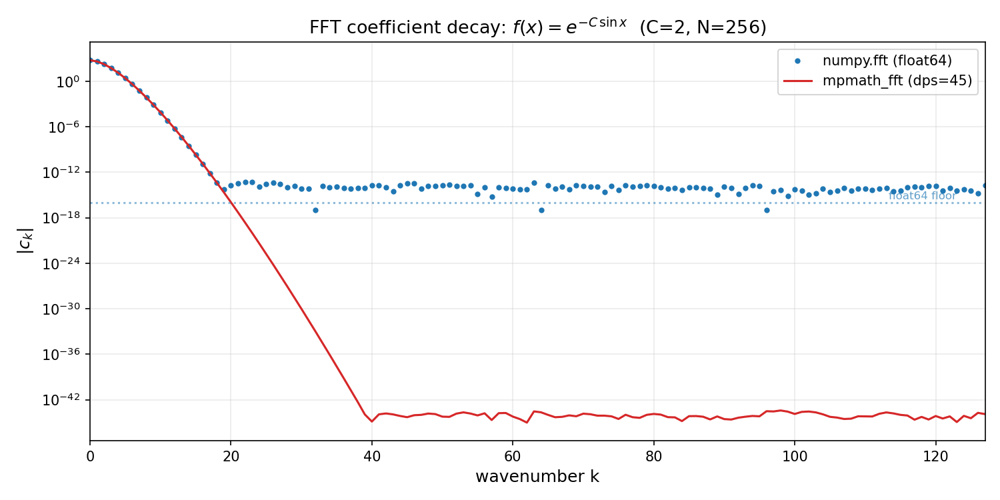

# mpmath_fft - Arbitrary-Precision FFT for mpmath

Cooley-Tukey, radix-2, and Bluestein chirp-Z FFT using mpmath types
stored in numpy object arrays.  Pure Python, no JIT, no numba.
Mirrors the `pynalgo.fft` API and plan structure.

Full documentation: https://mpmath-fft.readthedocs.io/

## Installation

```bash
pip install -e /path/to/mpmath_fft
```

Or run directly from the repo root (the package is importable as-is):

```bash
cd mpmath_fft/
python -c "from mpmath_fft import fft; print(fft(...))"
```

**Dependencies:** [`mpmath`](https://github.com/mpmath/mpmath) `>= 1.3`,
`numpy >= 1.24`, Python >= 3.10.

## Quick start

```python
import mpmath as mp
import numpy as np
from mpmath_fft import fft, ifft, build_plan

# 1D transform
x = np.array([mp.mpc(i, 0) for i in range(16)], dtype=object)
y = fft(x)
z = ifft(y)          # round-trip: z ~ x

# ND axis-aware
x2d = np.empty((3, 4), dtype=object)
# ... fill with mpc values ...
y2d = fft(x2d, axis=-1)

# Explicit plan (cached by N and mp.mp.dps)
plan = build_plan(128)
```

## API

| Function | Signature | Description |
|----------|-----------|-------------|
| `fft` | `fft(x, axis=-1)` | Forward DFT |
| `ifft` | `ifft(x, axis=-1)` | Inverse DFT: `conj(fft(conj(x))) / N` |
| `build_plan` | `build_plan(N)` | Build/cache a plan for transform size N |
| `clear_plan_cache` | `clear_plan_cache()` | Clear the plan cache |
| `fftshift` | `fftshift(x, axes=None)` | Shift zero frequency to center |
| `ifftshift` | `ifftshift(x, axes=None)` | Inverse of fftshift |
| `fftfreq` | `fftfreq(n, d=1.0)` | Frequency bins for n-point FFT |
| `rfftfreq` | `rfftfreq(n, d=1.0)` | Frequency bins for rfft (non-negative) |
| `rfft` | `rfft(x, n=None, axis=-1)` | Forward DFT of real input (`mp.mpf` -> `mp.mpc`) |
| ``irfft`` | ``irfft(x, n=None, axis=-1)`` | Inverse DFT returning real output (``mp.mpc`` -> ``mp.mpf``) |
| ``hfft`` | ``hfft(x, n=None, axis=-1)`` | FFT of Hermitian-symmetric input |
| ``ihfft`` | ``ihfft(x, n=None, axis=-1)`` | Inverse hfft: real input -> Hermitian half-spectrum |

Complex FFTs (`fft`, `ifft`, `fftshift`, `ifftshift`, `fftfreq`) operate on
`ndarray[dtype=object]` containing `mp.mpc` values.  Real-valued transforms
(`rfft`, `ihfft`) accept `mp.mpf` elements; their inverses (`irfft`, `hfft`)
accept `mp.mpc`.

### Real-valued transforms

`rfft(x, n=None, axis=-1)` computes the forward DFT of real-valued input
(`mp.mpf`) and returns only the non-redundant half of the spectrum:
indices 0..n//2, shape `(..., n//2 + 1, ...)`.  If `n > len(x)` the
input is zero-padded; if `n < len(x)` it is truncated.

`irfft(x, n=None, axis=-1)` reconstructs the full Hermitian-symmetric
spectrum from the half-spectrum, computes the inverse DFT, and returns
the real part (`mp.mpf`).  Default output length is `2*(M-1)` where
`M = x.shape[axis]`.

`hfft` / `ihfft` are re-expressed in terms of `rfft` / `irfft` via the
identities (verified against numpy.fft):

```
ihfft(x, n) = conj(rfft(x, n)) / n_used
hfft(X, n)  = n_used * irfft(conj(X), n=n)
```

where `n_used` is the explicit `n` parameter or `len(x)` / `2*(M-1)`.
`rfftfreq(n, d=1.0)` returns the non-negative frequencies
`f_k = k/(n*d)` for `k = 0..n//2`.

These follow numpy.fft conventions exactly, including the `n` padding/
truncation semantics and Hermitian half-spectrum layout.

## Algorithm coverage

The planner selects the fastest available decomposition for each
transform size:

| N | Strategy | Cost |
|---|----------|------|
| 1 | Identity (no-op) | O(1) |
| 3, 4 | Unrolled hard-coded DFT | O(1) |
| 5..31 (non-pow2) | O(N^2) naive DFT | O(N^2) |
| Power of 2 | Iterative radix-2 DIT | O(N log N) |
| Prime >= 32 | Bluestein chirp-Z -> power-of-2 convolution | O(N log N) |
| Composite >= 32 | Cooley-Tukey with recursive decomposition | O(N log N) |

### Bluestein chirp-Z

For prime N, the DFT is recast as a convolution padded to the next
power of 2 (`M = 2^p >= 2N+1`).  The convolution is computed via
three radix-2 FFTs of size M.  This handles any N, not just
highly-composite sizes.

## Plan structure

`build_plan(N)` returns an 8-tuple of flat numpy arrays following
the pynalgo.fft convention:

| Array | dtype | shape | Content |
|-------|-------|-------|---------|
| `nodes_type` | int8 | `(n_nodes,)` | Node type code (0=ident, 1=N=3, 2=N=4, 3=naive, 4=radix2, 5=CT, 6=Bluestein) |
| `nodes_N` | int64 | `(n_nodes,)` | Transform size at this node |
| `nodes_p1` | int64 | `(n_nodes,)` | N1 for CT, M for Bluestein, log2(N) for radix-2 |
| `nodes_p2` | int64 | `(n_nodes,)` | N2 for CT, log2(M) for Bluestein |
| `nodes_c1` | int64 | `(n_nodes,)` | Left child id (-1 = leaf) |
| `nodes_c2` | int64 | `(n_nodes,)` | Right child id (-1 = leaf) |
| `tw_data` | object | `(tw_total,)` | Concatenated twiddle factors (mp.mpc) |
| `tw_start` | int64 | `(n_nodes,)` | Offset into tw_data per node |

Node ids are pre-order (root=0).  The stack executor uses
dynamically-resized numpy arrays.

## Precision behavior

Plans are cached by `(N, mp.mp.dps)` because twiddle factors are
computed at the current mpmath precision.  Changing `mp.mp.dps`
after building a plan does not retroactively change the plan's
precision - a new plan is built on the next call.

The cache holds at most 128 entries.  When full, the oldest entry
is evicted (FIFO).  Use `clear_plan_cache()` to discard all
cached plans; useful after a bulk computation or precision change.

### Thread safety

`build_plan()` uses double-checked locking: concurrent calls for
different `(N, dps)` keys can build plans in parallel, and cache
inserts are serialised.  `clear_plan_cache()` acquires the same lock.

`fft()`, `ifft()`, `rfft()`, `irfft()` are also safe to call from
multiple threads. Each copies its input into a private buffer,
reads the cached plan (read-only after construction), and executes
on that buffer without shared mutable state.

Error at dps=D scales approximately as 10^(-D) * sqrt(N log N).
Observed round-trip errors:

| dps | N=100 threshold |
|-----|-----------------|
| 15  | 1e-11 |
| 50  | 2e-47 |
| 100 | 5e-95 |

### Comparison targets

- **dps=15:** Compare against `numpy.fft` (float64 reference, ~1e-15 floor).
- **dps >= 50:** Compare against naive O(N^2) DFT computed at the
  **same precision**.  Never compare high-precision output against
  numpy - float64 masks the true error.

## Key differences from pynalgo.fft

| Aspect | pynalgo.fft | mpmath_fft |
|--------|-------------|------------|
| Precision | float64 / complex128 | arbitrary (mpmath mpc) |
| Array dtype | complex128 | object |
| Compilation | @JIT / @JITG | pure Python |
| Twiddle exp() | `np.exp(-2j*pi*k/N)` | `mp.e ** (-2j*mp.pi*k/N)` |
| Plan cache | JIT cache handles reuse | explicit `{(N, dps): plan}` dict |

## Usage examples

See [`usage/`](usage/) for runnable demos.

**[`usage/demo.py`](usage/demo.py)** - precision convergence table,
2D transform, prime-size Bluestein, high-precision round-trip with
50-digit output.

**[`usage/spectral_decay.py`](usage/spectral_decay.py)** - plots
`|FFT(f)|` for `f(x) = exp(-C sin x)` on semilog axes, comparing
numpy.fft (float64 noise floor at ~1e-15) against mpmath_fft at
dps=45.

Output figure:



## Testing

```bash
bash run_tests.sh
```

Runs pytest, mypy (on ``mpmath_fft/``, ``tests/``, ``benchmarks/``), and ruff
(on all source, test, usage, and benchmark directories).

Tests cover:

- Correctness vs `numpy.fft` at dps=15 (pow2, composite, prime)
- Round-trip identity at dps=15, 50, 100
- Naive DFT comparison at dps=50, 100
- Precision convergence: 6 dps levels (15->100), error must decrease monotonically
- Linearity: `fft(a*x + b*y) = a*fft(x) + b*fft(y)`
- 2D/3D/4D axis dispatch and round-trip
- Plan cache reuse and precision invalidation

## Input validation

All public functions validate their inputs and raise clear errors:

- Non-ndarray input -> `TypeError("requires numpy ndarray, got ...")`
- Wrong dtype -> `TypeError("requires dtype=object array, got ...")`
- Wrong element type -> `TypeError("requires array elements of type mp.mpc, got ...")`
- Non-integer axis -> `TypeError("axis must be int, got ...")`
- Out-of-bounds axis -> `ValueError("axis N out of bounds for array with D dimensions")`
- Empty transform axis -> `ValueError("requires at least 1 element along transform axis")`
- `build_plan(0)` -> `ValueError("requires positive N, got 0")`
- `fftfreq(0)` / `rfftfreq(0)` -> `ValueError`

## Number theory helpers

Self-contained in the kernels module (`_kernels.py`, no pynalgo dependency):

- `_get_prime_factors(N)` - prime factorization
- `_is_prime(N)` - primality test (6k+(-)1 wheel)
- `_is_pow2(N)` - power-of-2 check
- `_balanced_split(N)` - find N = N1*N2 with N1 ~ sqrt(N),
  N1's prime factors a subset of N's

## Limitations

- **No JIT compilation.**  The use case is correctness at arbitrary
precision, not speed.
- **Precision scales wall time.**  mpmath arithmetic cost grows with
  `dps`.  A Bluestein FFT of prime N ~ 100 at dps=100 is ~10x slower
  than at dps=15.
- **Object arrays only.**  numpy vectorized operations (`np.dot`,
  `np.exp`) do not dispatch to mpmath on object arrays.  All
  arithmetic is done element-by-element in Python loops.
- **No GPU or parallel execution.**  Pure Python with no CUDA, OpenCL,
  or multiprocessing.  Threads can call transforms concurrently on
  different inputs, but a single transform uses one core.
- **No in-place transforms.**  All public functions copy input before
  operating.  The internal executor operates in-place on a private
  buffer.
- **mp.mpc format strings.**  `mp.mpc.__format__` does not accept
  format specs (e.g. `.1e`).  Use `float(val)` or `mp.nstr()` for
  printing.

## References

- Cooley, J. W. & Tukey, J. W. (1965). An algorithm for the machine
  calculation of complex Fourier series. *Math. Comp.*, 19(90), 297-301.
- Bluestein, L. I. (1970). A linear filtering approach to the
  computation of discrete Fourier transform. *IEEE Trans. Audio
  Electroacoustics*, 18(4), 451-455.
- Chu, E. & George, A. (1999). *Inside the FFT Black Box*. CRC Press.
- Johnson, S. G. & Frigo, M. (2009). Implementing FFTs in practice.
  In *Fast Fourier Transforms* (C. S. Burrus, ed.), Connexions.
- Frigo, M. & Johnson, S. G. (2005). The design and implementation of
  FFTW3. *Proc. IEEE*, 93(2), 216-231.

---

Author: Boris Daszuta

License: BSD 3-Clause
